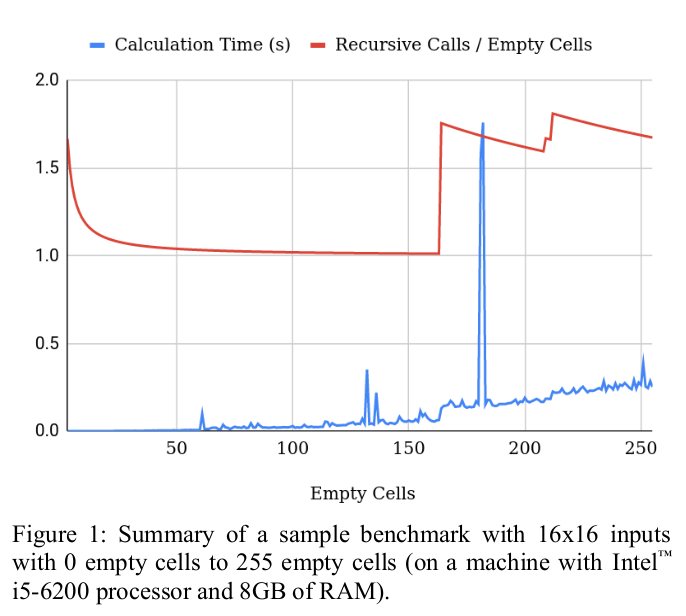

# A Sudoku Solver using C++ [experimental]

## Algorithm    

The Sudoku puzzle can be represented as a 9x9 or 16x16 matrix. In addition to the `puzzle` matrix, another matrix `allowed-values` is maintained which holds the possible valid values for each of the empty cells. Once an empty cell named `cell` is filled with a value `new-value`, the `allowed-values` matrix is also updated according to the basic rules of Sudoku; (i)The `new-value` is disallowed for each other cells in the same _row_, _column_, and _block_, (ii) Allowed values set of the `cell` is emptied. After the `puzzle` matrix and `allowed-values` matrices are initialized based on the original input, then each empty cell is filled gradually by a recursive function ([F1]).

```
Solve-Puzzle (puzzle, allowed-values, cell, new-value)                              [F1]
    if: Solved ( puzzle )
        return: TRUE
    puzzle [ cell ] ⟵ new-value
    Update-Allowed ( puzzle, &allowed-values, cell ) 
    cell ⟵ Get-Next-Empty-Cell ( puzzle, allowed-values )                           [F2]
    foreach: new-value ∈ Get-Next-Possible-Values ( puzzle, allowed-values, cell )  [F3]
        if: new-value ∈ allowed-values [ cell ]
            return: Solve-Puzzle ( puzzle, allowed-values, cell, new-value )
    return: FALSE
```

In a single call of this function, a single empty cell is updated. This function takes a cell and a new value
to the cell as well as the current state ( `puzzle` ) and current constraints ( `allowed-values` ). After the new value
is set to the cell, then the `allowed-values` matrix is updated to be ready for processing the next empty cell. A
`new-value` is chosen for the next cell and if that value is valid (available in `allowed-values`), the function is called
again for that cell and value and continues recursively. If the successive recursive calls together fail to fill the
whole puzzle, then continues with the next possible `new-value` value.
It is very important to reduce the total number of recursive calls of the above function. The strategy used here to
reduce recursive calls is limiting the search space by selecting the next empty cell to fill and the next new-value to
try, as stable as possible. Therefore, the need to back-track and update a filled value again will be reduced.

```
Get-Next-Empty-Cell ( puzzle, allowed-values )                                      [F2]
    foreach: cell ∈ Empty-Cells ( puzzle )
        variance-scores [ cell ] ⟵ [ 
                        Count ( allowed-values [ cell ] ),
                        Count ( Σ allowed-values [ row |column | block of cell ] ), 
                    ]
    return: cell of Min ( variance-scores )
```

The empty cell with a minimum estimated variability is chosen as the next cell. The variability is calculated based on the counts of the total allowed value (i) for the given cell, and (ii) for the give cell’s neighbours (cells within the
same row, column or block) (see function [F2]). The assumption here is that if the variability is lesser, then a
change to that cell will be more stable.

```
Get-Next-Possible-Values ( puzzle, allowed-values, cell )                           [F3]
    possible-values ⟵ allowed-values [ cell ]
    foreach: value ∈ possible-values
        variance-scores [ value ] ⟵ Count ( puzzle [ value ] ),
    return: values of Sorted ( variance-scores )
```
The order of the new values to be tried is also decided by estimating the variability of values. Here, a simple
assumption is used based on the fact that each value must have the same count in the solved puzzle. It is assumed
that if a value is lesser appeared in the current state of puzzle, then it is more stable to be used to fill the next cell. Therefore, the values are prioritised (sorted) on their counts and use as the array of possible values to be tried.

## Results

On average, the algorithm able to solve a puzzle of
any number of empty cells with a total number of
recursive calls less than twice of the empty cells
count. For 16x16 puzzles, the algorithm performs
better when the number of empty cells is below 160;
and also, the time cost is very low for most of the
inputs; and, for 16x16 inputs with <180 number of
empty cells, the total time consumption is very lower.



### Sample run

```
tharindu@tharindu-pc:~/tmp/a-sudoku-solver.cpp$ ./test.sh
$ [START] /home/tharindu/tmp/a-sudoku-solver.cpp/sample_inputs/input1.txt

Input:
  0  2  0  0  0  7  5  0  8
  0  0  7  0  0  0  3  0  0
  1  0  0  0  0  2  0  6  0
  0  0  5  0  0  0  4  0  0
  0  3  0  8  1  6  0  0  0
  0  0  0  4  0  0  0  8  0
  5  0  0  0  6  1  8  0  0
  0  0  3  0  4  0  6  0  0
  9  0  0  5  7  0  0  4  0

Output:
  3  2  4  6  9  7  5  1  8
  6  5  7  1  8  4  3  2  9
  1  9  8  3  5  2  7  6  4
  8  6  5  7  2  9  4  3  1
  4  3  9  8  1  6  2  5  7
  2  7  1  4  3  5  9  8  6
  5  4  2  9  6  1  8  7  3
  7  1  3  2  4  8  6  9  5
  9  8  6  5  7  3  1  4  2


$ Total Zeros in input : 53
$ Total Recursive calls: 55
$ Calculation Time     : 0.000128 s
$ Total Program Time   : 0.000334 s
$ [DONE]
$ [START] /home/tharindu/tmp/a-sudoku-solver.cpp/sample_inputs/input2.txt

Input:
  0  1  0  0  0  0  8  7  0
  0  0  0  0  0  0  4  0  1
  0  7  6  0  0  0  0  0  0
  9  0  0  0  0  0  0  0  5
  1  0  0  8  0  4  7  0  6
  0  6  0  0  0  0  0  0  0
  0  0  0  0  7  5  0  0  4
  0  0  0  1  4  0  0  9  0
  0  5  0  2  0  9  1  3  0

Output:
  5  1  3  4  6  2  8  7  9
  8  2  9  7  5  3  4  6  1
  4  7  6  9  1  8  2  5  3
  9  4  8  6  2  7  3  1  5
  1  3  5  8  9  4  7  2  6
  7  6  2  5  3  1  9  4  8
  2  9  1  3  7  5  6  8  4
  3  8  7  1  4  6  5  9  2
  6  5  4  2  8  9  1  3  7


$ Total Zeros in input : 55
$ Total Recursive calls: 72
$ Calculation Time     : 0.00016 s
$ Total Program Time   : 0.000352 s
$ [DONE]
$ [START] /home/tharindu/tmp/a-sudoku-solver.cpp/sample_inputs/input3.txt

Input:
  0  9  0  0  0  0  6  0  0
  2  0  0  0  0  8  0  0  7
  0  0  7  0  0  0  0  9  0
  0  0  8  0  9  0  0  1  0
  0  5  0  0  0  2  0  0  0
  6  0  0  3  0  0  0  0  4
  0  0  1  0  5  0  0  8  0
  9  0  0  4  0  0  0  0  3
  0  6  0  0  0  7  1  0  0

Output:
  8  9  5  7  2  3  6  4  1
  2  4  6  9  1  8  5  3  7
  1  3  7  5  4  6  8  9  2
  7  2  8  6  9  4  3  1  5
  4  5  3  1  7  2  9  6  8
  6  1  9  3  8  5  2  7  4
  3  7  1  2  5  9  4  8  6
  9  8  2  4  6  1  7  5  3
  5  6  4  8  3  7  1  2  9


$ Total Zeros in input : 57
$ Total Recursive calls: 1616
$ Calculation Time     : 0.00244 s
$ Total Program Time   : 0.00266 s
$ [DONE]
$ [START] /home/tharindu/tmp/a-sudoku-solver.cpp/sample_inputs/input_hex1.txt

Input:
 12  0  8  9  0  6 15  0  4  0  0 11 14  0 13  1
  0  0  5  0  0  8  0  0  0 13  0 16 11  0  0  3
 11  0  0  0  0  0  0  0  0  0  0  5  4  8  0  0
  0  0  6  0  0  0 10 16  0  0  0  0  0  0  0  9
  0  5  0  0 12  9  0  0  0 15  0  8 10  4  0  0
  0  0 15  4  8 13  0  0  0  0 16 14 12  0  0  5
 10 16  0  8  0  0  6 14  0  4  0  0  0  0  9  0
  6  0  0 14  0 16  4  0  3  5 11  9 13  0  1  0
  0  9  0  0  0  0  0  0 12  0  0  0  0  1 14  6
  0  0 14  0  0  0  0  0  0  9  0  0 16  0 15  0
  0  0 11  0 10  0 16  0  0  7  8  0  0  0 12 13
  0  0  0 13  0 11 12  0  0  0  0 15  8  3  5  0
  8 11  0 10  0 12  2  0  0  0  6  0  0  7  4  0
 14  0 13 15 16  0  8  0 11  0  0  0  0  9  0  0
  0  0  0  0 15  0 11  0  0 14  0  0  6  0  0  0
  0  7  4  6  1 10 13  0  0 12  0  0 15  0  0  0

Output:
 12 10  8  9  2  6 15  5  4  3  7 11 14 16 13  1
  1 15  5  2  4  8 14  7  9 13 10 16 11 12  6  3
 11 14 16  7 13  3  9 12  1  6  2  5  4  8 10 15
  4 13  6  3 11  1 10 16 14  8 15 12  2  5  7  9
 13  5  7 11 12  9  3  2  6 15  1  8 10  4 16 14
  9  3 15  4  8 13  1 11  7 10 16 14 12  6  2  5
 10 16  1  8  5 15  6 14 13  4 12  2  3 11  9  7
  6  2 12 14  7 16  4 10  3  5 11  9 13 15  1  8
 15  9 10 16  3  2  5  8 12 11 13  4  7  1 14  6
  5  8 14 12  6  4  7 13  2  9  3  1 16 10 15 11
  3  4 11  1 10 14 16 15  5  7  8  6  9  2 12 13
  7  6  2 13  9 11 12  1 10 16 14 15  8  3  5  4
  8 11  9 10 14 12  2  3 15  1  6 13  5  7  4 16
 14 12 13 15 16  5  8  6 11  2  4  7  1  9  3 10
  2  1  3  5 15  7 11  4 16 14  9 10  6 13  8 12
 16  7  4  6  1 10 13  9  8 12  5  3 15 14 11  2


$ Total Zeros in input : 150
$ Total Recursive calls: 152
$ Calculation Time     : 0.000684 s
$ Total Program Time   : 0.000967 s
$ [DONE]
$ [START] /home/tharindu/tmp/a-sudoku-solver.cpp/sample_inputs/input_hex2.txt

Input:
 14  0  7  2  0  0 10  0  0  3  0  0  6  0  0  1
 13  0  0  0  0  2  0  0  0  0  0  0  0  0 16  0
 12  0  0  0  0  1  0  3 14  0  0  0  4  5  0  9
  9 10 15  0  0  0  0  0  5  0  1  0  0 13 11  0
  0 16  0  1  0  0  0 14  2  6  0  9  3 12 10  4
  0  7 10  0  8  0  1 12  4 11  0  0  0  0  9  0
  0  3  0 14  2  0  0 15  0  0  0 12  0  0 13  6
 11  0  0  0 13  0  3  0 15  1  5  0 16  0  0  0
  0  0  0 16  0 12  2  9  3  0  0  0  0  0  0  0
  0  5  0  6 11  0  0  8  0 13 14  1  9  0  0 16
  0  0  9  0  0  0  0 13  0  0  8  0  0  0  5  3
 10  0  0 15  3  6  0  0  0 16  4  0  0  8 14  0
  0 14  3  4  0  0  0  0  0  0 15 11  1  0  0  0
  5  9 11  0  0  0 15  0  0  0  6 16 12  0  4  7
  0 15  6  8 12  0 16  0  0  0  0  0  0  0  0  0
  0  0  0  0  0  0  0  0  0  0  0  0  8  0  3  0

Output:
 14  8  7  2  4  9 10  5 16  3 11 13  6 15 12  1
 13  1  4  5 14  2 11  7  6  9 12 15 10  3 16  8
 12  6 16 11 15  1 13  3 14  2 10  8  4  5  7  9
  9 10 15  3  6  8 12 16  5  4  1  7 14 13 11  2
 15 16  8  1  5 11  7 14  2  6 13  9  3 12 10  4
  6  7 10 13  8 16  1 12  4 11  3 14 15  2  9  5
  4  3  5 14  2 10  9 15  8  7 16 12 11  1 13  6
 11  2 12  9 13  4  3  6 15  1  5 10 16  7  8 14
  8  4 14 16 10 12  2  9  3 15  7  5 13  6  1 11
  3  5  2  6 11  7  4  8 12 13 14  1  9 10 15 16
  1 12  9  7 16 15 14 13 11 10  8  6  2  4  5  3
 10 11 13 15  3  6  5  1  9 16  4  2  7  8 14 12
  2 14  3  4  9  5  8 10  7 12 15 11  1 16  6 13
  5  9 11 10  1  3 15  2 13  8  6 16 12 14  4  7
  7 15  6  8 12 13 16  4  1 14  9  3  5 11  2 10
 16 13  1 12  7 14  6 11 10  5  2  4  8  9  3 15


$ Total Zeros in input : 151
$ Total Recursive calls: 153
$ Calculation Time     : 0.000665 s
$ Total Program Time   : 0.000981 s
$ [DONE]
$ [START] /home/tharindu/tmp/a-sudoku-solver.cpp/sample_inputs/input_hex3.txt

Input:
  0 15  1  0  4 16 12  0  0  5  0  9  7  0  0  8
  0  0  0  0 11  0 15  3  0  0 13  0  0  0 16  0
  0  0  7  3  0  0 10  6 11  0 14  0  0  0  0  9
  0  0 14  0  0  0  7  0 16  4  0  0  0  0  0 13
  0  0 16  0  8  0 13  0  1  0  6  0  0 15  5 11
 14 11 12  8  0  0  0 15  2 13  4  0 16  0  0  7
 15 13  4  0 14  0  5  0  0  0  0  0  0  0  0  3
  0  9  0  0  0  0 11  0  0  0  0 14  0  0  6 12
  0  0  0  0  2  6  0  5 10 16 12  8  9  0  0 15
  0  0  0  0 15  0  0  0  0 14  0  3  0  0  0  0
  8  0 11  0  0  0 16  0 13 15  0  0  0  0  0 10
  0  0  0  7  0 13  0 10  9  0  0  0  0 16 12  0
 16  7  0 13  6 12  0  0  0 10  0  0  0  0  9  0
 12  0  5 15  0  0 14 16  8  0 11  0  0  0  0  0
  0  2  3  0  0  9  0  0 12  0  0  1  0  0 10  0
  0  0  0 10  0  0  0 11  4  0  0  6  0 13  8  0

Output:
 13 15  1 11  4 16 12  2  3  5 10  9  7  6 14  8
  9  8  2 12 11 14 15  3  6  1 13  7  5 10 16  4
  4 16  7  3 13  5 10  6 11  8 14  2  1 12 15  9
  6 10 14  5  9  8  7  1 16  4 15 12  2  3 11 13
  7  3 16  2  8  4 13  9  1 12  6 10 14 15  5 11
 14 11 12  8 10  3  6 15  2 13  4  5 16  9  1  7
 15 13  4  6 14  1  5 12  7 11  9 16 10  8  2  3
  5  9 10  1 16  2 11  7 15  3  8 14 13  4  6 12
  3  4 13 14  2  6  1  5 10 16 12  8  9 11  7 15
 10 12  6 16 15 11  9  8  5 14  7  3  4  2 13  1
  8  1 11  9 12  7 16 14 13 15  2  4  6  5  3 10
  2  5 15  7  3 13  4 10  9  6  1 11  8 16 12 14
 16  7  8 13  6 12  2  4 14 10  3 15 11  1  9  5
 12  6  5 15  1 10 14 16  8  9 11 13  3  7  4  2
 11  2  3  4  5  9  8 13 12  7 16  1 15 14 10  6
  1 14  9 10  7 15  3 11  4  2  5  6 12 13  8 16


$ Total Zeros in input : 151
$ Total Recursive calls: 153
$ Calculation Time     : 0.000726 s
$ Total Program Time   : 0.00116 s
$ [DONE]

```
